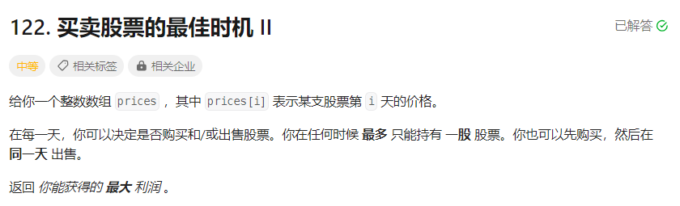
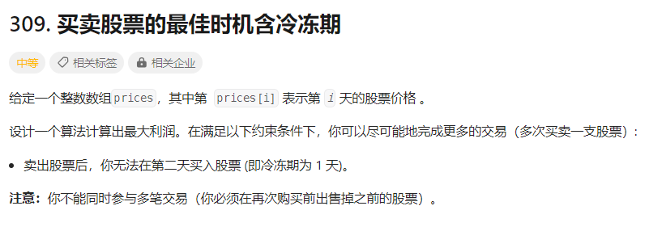
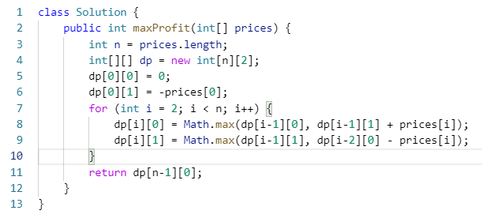

# 股票问题
人生只做一件事

人不要太贪心,你只能持有一只股票

**状态机dp**

在基础版的股票问题中:

1. 只看每一天,利润可以是 0,  prices[i],  -prices[i]
2. 前 i 天的利润 = 前 i-1 天的利润 + 第 i 天的利润
3. dp[i][0]表示第i天结束后没买,dp[i][1]表示第i天结束后买了
4. dp[i][0] = max(dp[i-1][0], dp[i-1][1] + prices[i])
5. dp[i][1] = max(dp[i-1][1], dp[i-1][0] - prices[i])
6. 【边界】dp[0][0] = 0, dp[0][1] = -prices[0]
7. max(dp[i][0], dp[i][1]) = dp[i][0]
8. return dp[n-1][0]

加**冷冻时间**也一样可以解决

[灵神的讲解十分精彩](https://www.bilibili.com/video/BV1ho4y1W7QK/?vd_source=7e002a4fb29d232229ab19a2b58619e0)

    